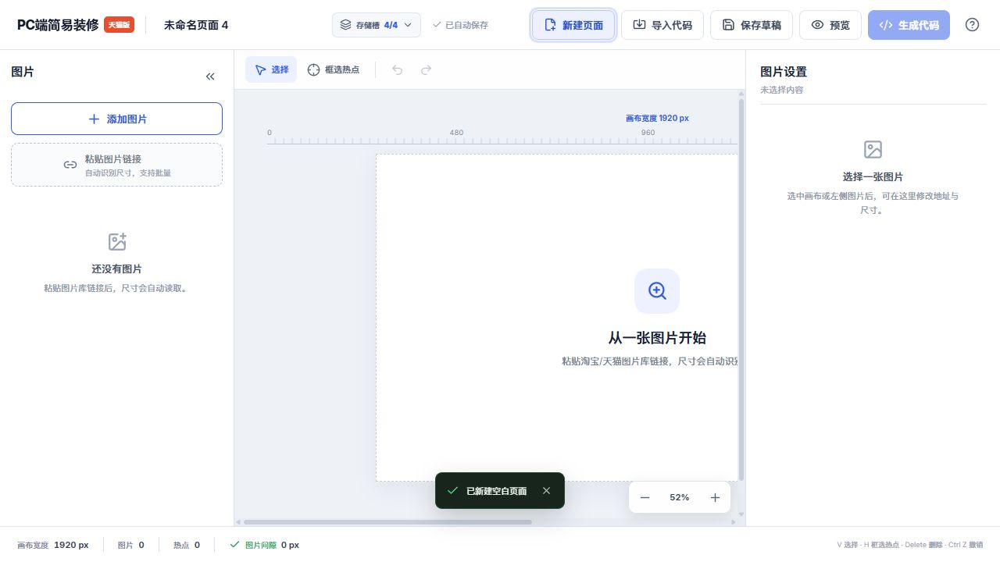

# 热区工坊 HotZone Studio（天猫 / 淘宝）

一款免费、开源、本地运行的淘宝/天猫 PC 店铺图片热点编辑器。它只保留最常用的流程：粘贴图片链接、自动识别尺寸、直接框选热点、无缝拼接，并生成可粘贴到装修后台的 HTML。

> 本项目是独立开源工具，与淘宝、天猫及其关联公司无隶属或官方合作关系。平台规则可能变化，正式发布前请先在店铺后台预览。



## 主要功能

- 粘贴一条或多条图片库链接，自动读取原图宽高。
- 在图片上直接拖拽框选热点，可移动、缩放、复制和删除。
- 商品链接未填写时红色提醒，填写后绿色确认，不限制链接格式。
- 多张图片按 `0 px` 间隙拼接，避免模块间白缝。
- 生成天猫/淘宝 PC 装修可识别的 `data-w="mk"` / `data-w="area"` HTML 结构。
- 三种店铺宽度：天猫 990、淘宝专业/智能版 950、淘宝基础版（190+750 布局右栏）750，通栏偏移分别处理。
- 通用版：不绑定平台，输出自适应百分比热区的独立 HTML，可粘进任意网站（自建站、WordPress、Shopify 等）。
- 页面装修（多图拼接）与店招（单图、120/150 固定高度）两种项目类型，店招同时提供「全屏通栏」和「居中显示」两种代码。
- 平台、显示方式、项目类型与店招高度的选择会随存储槽分别记住，切换页面不丢设置。
- 导入本工具或兼容旧工具生成的代码，继续修改图片与链接。
- 多页面存储槽、本地自动保存、页面复制和项目文件备份。
- 左侧图片栏可收起，热点坐标与尺寸设置按需展开。
- 所有项目数据只保存在浏览器本地或用户主动下载的文件中。

## 平台怎么选

| 选项 | 适用店铺 | 代码粘贴位置 | 通栏偏移 |
| --- | --- | --- | --- |
| 天猫 · 990 | 天猫店铺 | 990 布局里的「自定义内容区」 | -465 |
| 淘宝 · 950 | 淘宝专业版/智能版（950 通栏布局） | 950 布局里的「自定义内容区」 | -485 |
| 基础版 · 750 | 淘宝基础版（只有左 190 + 右 750 布局） | **右侧 750 栏**的「自定义内容区」，粘错栏会整体偏移 | -685 |
| 通用版 · 自适应 | 淘宝天猫**以外**的任意网站 | 任意支持 HTML 的地方 | 不适用（自适应） |

### 通用版

不绑定任何平台，输出一段**自包含的自适应 HTML**：

- 图片 `width:100%`，热点用**百分比**定位，整块跟着容器宽度等比缩放 —— 从 1920 到手机 375 宽，热点都不会错位。
  （淘宝那套 `usemap` 的 `coords` 是死像素，图片一缩放就错位，所以通用版不用它。）
- 只有内联样式，**不需要额外 CSS，也不需要 JS**，不依赖任何平台类名，可以直接粘进自建站、WordPress、Shopify 等任意支持 HTML 的地方。
- `` 上写了原图 `width`/`height`（浏览器提前知道宽高比，加载时不抖动）与 `data-ow`/`data-oh`（供「导入代码」原样读回继续编辑）。
- 显示方式在通用版下的含义：**铺满** = 宽度 100%，跟着所在容器走；**居中** = 最宽不超过原图宽，两侧留白。
- 通用版没有「店招」这一说（那是淘宝页头的固定模块），选中后不显示店招选项。

生成的结构大致是：

```html
<div class="hotzone-studio" style="width:100%;line-height:0;font-size:0;">
  <div class="hotzone-item" style="position:relative;display:block;line-height:0;font-size:0;">
    
    <a class="hotzone-area" data-w="area" href="…" target="_blank" rel="noopener" aria-label="热点 01"
       style="position:absolute;left:31.25%;top:25%;width:20.8333%;height:37.5%;display:block;z-index:2;"></a>
  </div>
</div>
```

- 店招宽度与页面模块宽度不是一回事：淘宝 C 店（含基础版）店招统一 950 宽，选基础版做店招时会自动按 950 输出。
- 切换平台后顶部像素条上的「模块可视区」高亮段会同步移动，标出通栏在店铺里真正能显示的窗口，工具栏右侧的「输出目标」胶囊也会标明当前设置。通用版没有固定模块窗口，因此不显示高亮段。
- 「全屏通栏」按 1920 整幅输出并突破模块宽度；「居中显示」按模块宽度输出，代码最短最稳，按后台实际表现二选一。
- 店招代码粘到「店铺招牌 → 自定义招牌 → 源码」；150 高度需要隐藏系统导航时，用代码弹窗里提供的 CSS 粘到「系统导航 → 显示设置」。

## 直接使用

### Windows 成品包

从 GitHub Releases 下载 `Source code (zip)` 并解压，确认电脑已安装 [Node.js](https://nodejs.org/) 后，双击 `启动热区工坊.bat`。浏览器会自动打开 `http://127.0.0.1:47317/`。

关闭启动窗口即可停止本地服务。重新打开同一地址时，浏览器中的存储槽和草稿会自动恢复。

### 从源码运行

需要 Node.js 18+ 与 pnpm：

```bash
pnpm install
pnpm dev
```

打开终端中显示的本地地址即可开发和调试。

## 使用流程

1. 点击“添加图片”，每行粘贴一个图片库链接；读取失败时可补充备用宽高。
2. 点击“框选热点”，在图片上拖出点击区域。
3. 在右侧填写商品或活动链接，选择新窗口或当前窗口打开。
4. 需要多个页面时，点击顶部“新建页面”或打开“存储槽”。
5. 点击“生成代码”，先选对平台/项目类型（页面或店招），再复制 HTML 到对应装修模块。
6. 正式发布前使用后台预览检查图片、热点位置与跳转链接。

快捷键：`V` 选择、`H` 框选热点、`Delete` 删除、`Ctrl + Z` 撤销、`Ctrl + Shift + Z` 重做。

## 项目备份与迁移

- 浏览器会自动保存当前工作区。
- “保存草稿”会下载 `.putu.json` 文件，适合作为长期备份。
- “导入项目文件”可恢复完整项目。
- “导入代码”可从已生成的 HTML 恢复图片、热点和链接；马工等外部工具导出、代码里没写图片尺寸时，会自动联网读取原图尺寸，个别读取失败的图片可选中后点右侧“重新识别”。

浏览器缓存可能被清理，重要页面请同时保存 `.putu.json` 文件。

## 构建与测试

```bash
pnpm install
pnpm test
pnpm build
pnpm start
```

- `pnpm test`：运行代码生成与导入测试。
- `pnpm build`：类型检查并输出生产文件到 `dist/`。
- `pnpm start`：在 `127.0.0.1:47317` 启动生产版本。

## 隐私与安全

本项目没有后端，也不会主动上传店铺项目。图片由浏览器直接访问你填写的公开图片链接。请勿将店铺账号、Cookie、密钥、顾客信息或未获授权的素材提交到公开 Issue、截图或项目文件中。

## 参与贡献

欢迎提交 Issue 和 Pull Request。提交前请运行 `pnpm test && pnpm build`，更多说明见 [CONTRIBUTING.md](CONTRIBUTING.md)。

## 开源许可

[MIT License](LICENSE)

